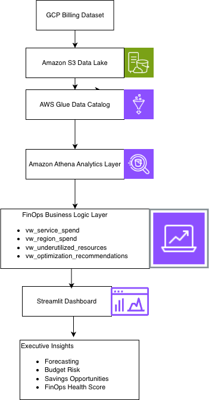
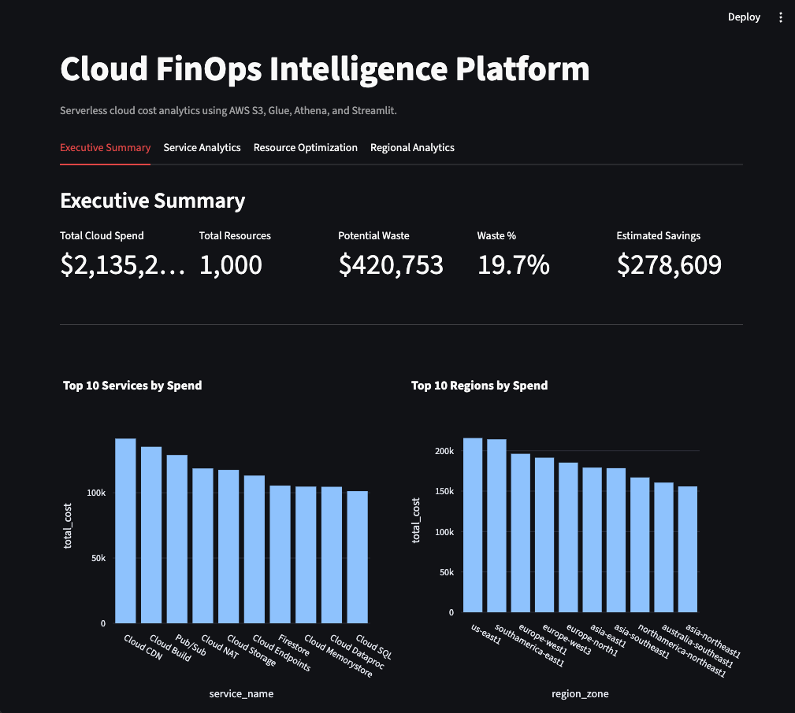
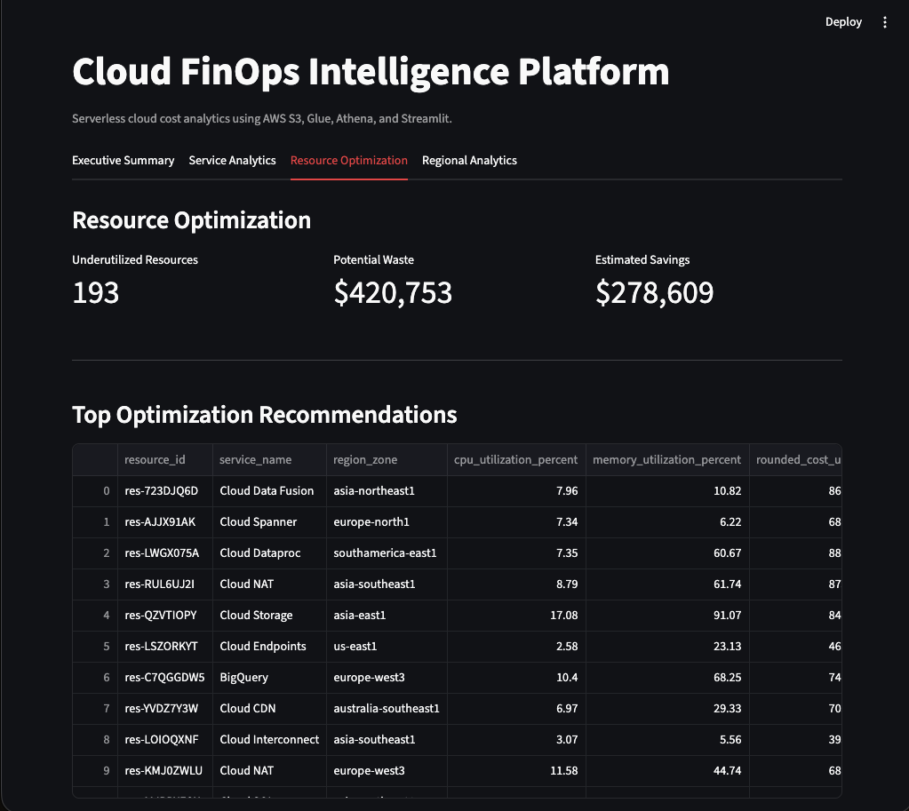
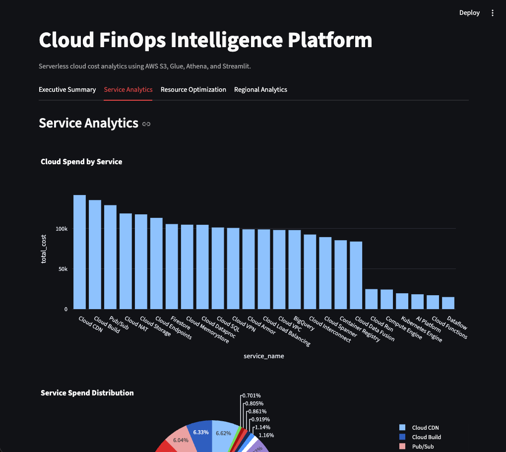
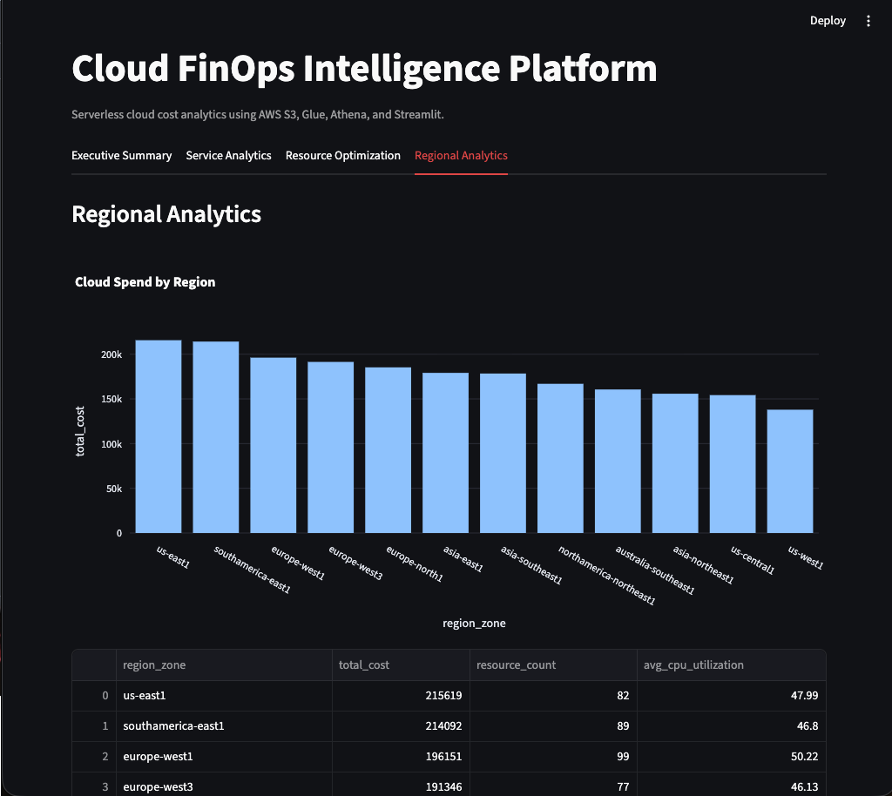
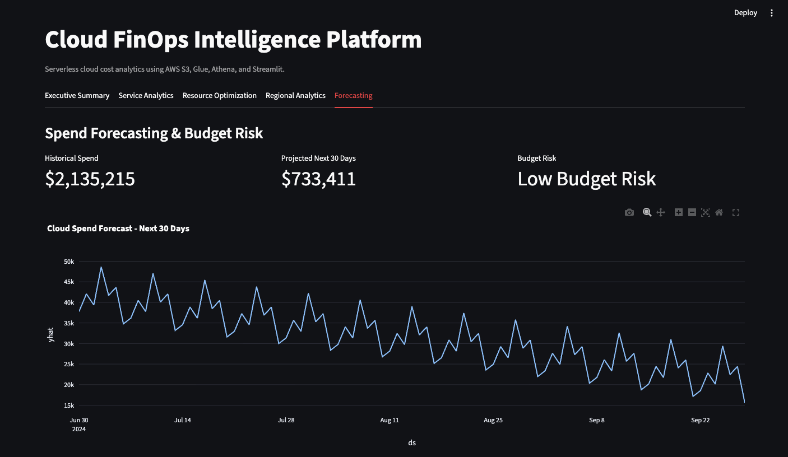

# Cloud FinOps Intelligence Platform

A serverless cloud cost analytics and optimization platform built on AWS S3, AWS Glue, Amazon Athena, Python, and Streamlit.

The billing data analyzed here is a cloud billing export with per resource cost and utilization fields. The analytics stack that processes it is AWS serverless, which is the point of the project: the billing source and the analytics platform do not have to be the same cloud.

> Data source: TODO, add where this dataset came from (public dataset, generated, or other).

## Business Problem

Cloud teams often struggle to identify where infrastructure costs are increasing, which services drive spend, and which resources are underutilized. This project analyzes cloud billing and utilization data to identify waste, forecast future spend, and generate FinOps optimization recommendations.

## Key Results

- Analyzed 1,000 cloud resource billing records
- Processed $2.13M+ in cloud spend
- Identified $420K+ in potential waste
- Estimated $278K+ in savings opportunities
- Detected 193 underutilized resources (CPU utilization under 20%)
- Built forecasting and budget risk analysis using 61 days of spend data

## Architecture

```text
Cloud Billing Dataset
        |
Amazon S3 Data Lake
        |
S3 Event Notification
        |
AWS Lambda
        |
AWS Glue Crawler
        |
AWS Glue ETL Job
        |
Processed Parquet Dataset
        |
AWS Glue Data Catalog
        |
Amazon Athena
        |
FinOps Analytics Views (sql/finops_views.sql)
        |
Streamlit Dashboard
        |
Forecasting and Executive Insights
```



Ingestion is event driven rather than scheduled: dropping a billing file in S3 fires an event notification, which triggers Lambda, which starts the Glue crawler and ETL job. No manual step and no polling.

## Analytics layer

The Athena views in [`sql/finops_views.sql`](sql/finops_views.sql) hold the business logic, so the dashboard stays a thin presentation layer:

| View | What it answers |
|---|---|
| `vw_service_spend` | Which services drive spend, with average CPU and memory utilization |
| `vw_region_spend` | Where spend sits by region or zone |
| `vw_underutilized_resources` | Which resources run under 20% CPU while still costing money |
| `vw_optimization_recommendations` | Which specific resources to rightsize or shut down, and the savings estimate |

## Repository Structure

```text
.
├── dashboard/
│   └── app.py                 # Streamlit dashboard (demo mode or live Athena)
├── data/
│   ├── raw/                   # Source billing dataset
│   └── demo/                  # Precomputed CSVs so the dashboard runs without AWS
├── docs/
│   ├── architecture/
│   └── screenshots/
├── sql/
│   └── finops_views.sql       # Athena views the dashboard queries
├── requirements.txt
└── README.md
```

## Run the dashboard

### Demo mode (no AWS account needed)

Reads the sample CSVs in `data/demo/`:

```bash
git clone https://github.com/OmkarK23/aws-finops-intelligence-platform.git
cd aws-finops-intelligence-platform
pip install -r requirements.txt
streamlit run dashboard/app.py
```

### Live mode (queries Athena)

Requires AWS credentials, the Glue Data Catalog database, and the views from `sql/finops_views.sql` created in Athena:

```bash
export DEMO_MODE=false
export ATHENA_S3_STAGING_DIR=s3://your-bucket/athena-results/
export AWS_REGION=us-east-1
streamlit run dashboard/app.py
```

## Dashboard Screenshots

### Executive Summary


### Resource Optimization


### Service Analytics


### Regional Analytics


### Forecasting


## Known limitations

- Demo mode reads precomputed CSV snapshots, so the numbers are fixed rather than live query results.
- Forecasting needs Prophet installed. The dashboard degrades gracefully and hides the forecast if it is missing.
- The Glue crawler and ETL job were configured in the AWS console, so that configuration is not version controlled in this repo.

## Author

**Omkar Kalekar**

- GitHub: https://github.com/OmkarK23
- LinkedIn: https://www.linkedin.com/in/omkar-kalekar/
- Portfolio: https://omkark23.github.io/portfolio-website/
